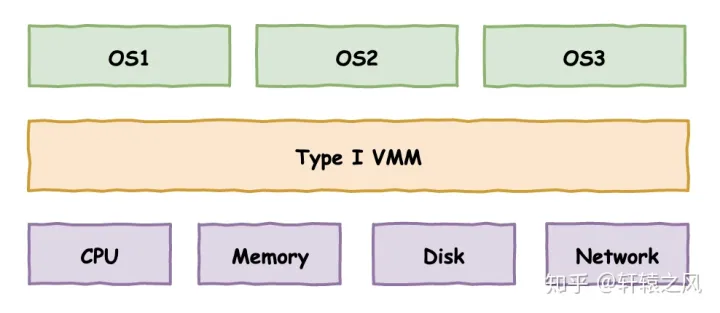
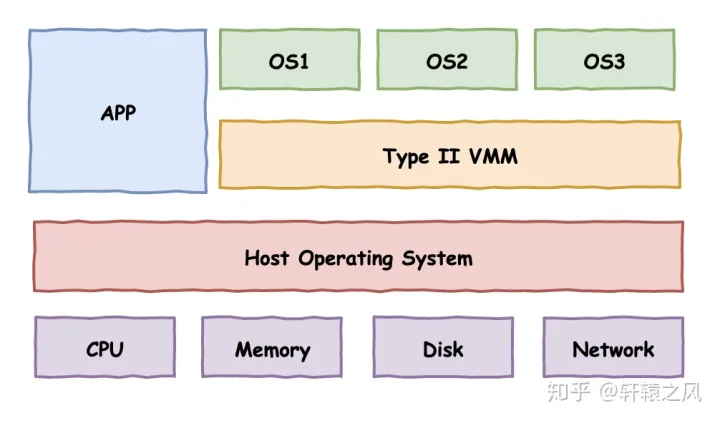
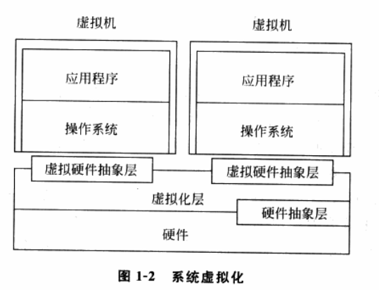
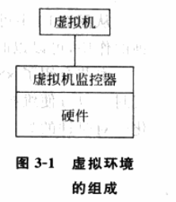
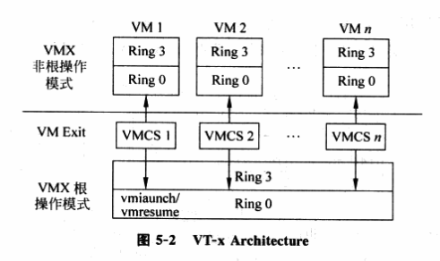
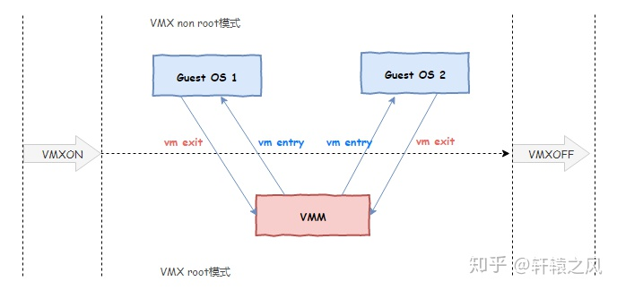
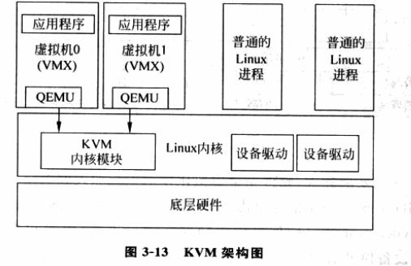
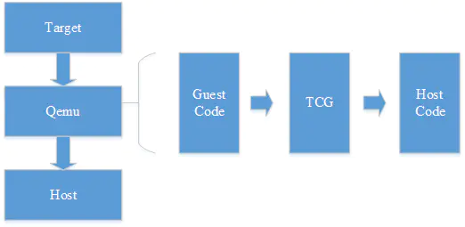
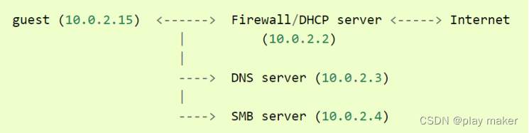
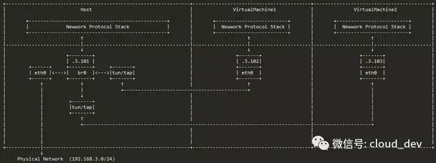

# Qemu入门

## 前言--虚拟化

在介绍一些虚拟化概念时先了解两个重要名词：

+ 宿主机(Host)：拥有实际物理资源
+ 客户机(Guest)：拥有虚拟化的资源

如讲一个物理计算机虚拟为一个或多个虚拟计算机，则这个物理计算机通常被称为`Host`。而其上运行的虚拟机被称为客户机(`Guest Machine`)。如果宿主机上运行由操作系统通常成为宿主机操作系统(`Host OS`)，而虚拟机中运行的操作系统被称为客户机操作系统(`Guest OS`)

这里主要介绍硬件抽象层上的虚拟化即通过虚拟硬件抽象层来实现虚拟机，为客户操作系统呈现和物理硬件相同或相近的硬件抽象层，**其`ISA(Instruction Set Architecture，指令集)`是相同的**；客户机的大部分指令可以在宿主处理机上直接运行，只有一些敏感指令才会需要虚拟化处理


一般有两种虚拟结构：





第一种方案**直接凌驾于硬件之上**，构建出多个隔离的操作系统环境；如VMware ESXi

第二种方案**依赖于宿主操作系统**，在其上构建出多个隔离的操作系统环境；如熟悉的VMware Workstation

主要的虚拟化相关部分可以看做：



这个虚拟化层被称为虚拟机监控器(Virtual Machine Monitor，`VMM`)；不管采用何种虚拟化方式，VMM对物理资源的虚拟可以归结为三个主要任务：

+ 处理器虚拟化
+ 内存虚拟化
+ IO虚拟化

一般来说虚拟环境由三个部分组成：硬件，VMM和虚拟机如图：



在没有虚拟化的情况下，操作系统直接运行在硬件之上管理底层物理硬件，这就构成了一个完整的计算机系统；**而在虚拟环境下VMM抢占了操作系统的位置，变成了证实的物理硬件的管理者**，欺骗上层操作系统。

当VMM接管硬件层，他表现也像一个操作系统，不过这个操作系统负责其上虚拟机内进程调度


### CPU虚拟方案

为了VMM可以完全控制系统资源，他不允许直接执行虚拟机上操作系统的**敏感指令**(如读写敏感寄存器或内存，IO指令等)；即敏感指令必须在VMM监控下进行或由VMM完成


常见的虚拟化方案有：

+ 基于二进制翻译的全虚拟化：将虚拟机中要执行的指令`翻译`成安全的指令在宿主机上执行。对于特权指令的翻译分为两种，简单的VMM就模拟指令效果修改模拟环境中的某个标志位就行，而复杂指令需要从模拟环境跳到模拟器中深度模拟
  + 性能损耗大，效率低
+ 硬件辅助的全虚拟化：由于软件实现的二进制翻译技术存在`虚拟化漏洞`，因此后来硬件场商在各种硬件中加入专门针对虚拟化的支持如`Intel-VT/AMD-V`这是cpu提供的虚拟化标志位
+ 半虚拟化：修改虚拟机操作系统内核，替换掉不能虚拟化的指令通过超级调用`hypercall`直接和底层的虚拟化层通讯
  + 性能好但修改操作系统难度大，开源的Linux可以支持，但无法支持Windows


**硬件辅助的全虚拟化如Intel-VT**：引入两种操作模式，成为`VMX`操作模式

+ 根操作模式(VMX Root Operation): VMX运行所处的模式，简称根模式
+ 非根操作模式(VMX Not-Root Operation): 客户机运行所处的模式，简称非根模式



每种模式下都有R0~R3特权级。故在VT技术使用的情况下，描述程序运行在某个特权级还得指出当前时根模式还是非根模式；VMCS与上文虚拟寄存器概念类似，每个`VMCS`对应一个虚拟CPU，在任意给定时刻VMCS与物理CPU是一对绑定关系

当Not-root虚拟机使用敏感指令或触发异常将切换到root模式由VMM处理，然后返回Not-root模式；免除了二进制翻译虚拟化又不需要修改虚拟机内核




## 架构

Qemu(Q emulator)是一款纯软件实现的模拟器，几乎可以模拟任何硬件设备。如模拟一个arm架构的虚拟机。

但因为纯软件实现的虚拟机所有的指令都要经过Qemu，再到真实的物理内核所以速度会非常慢。因此一般会搭配`KVM`(Kerner-based Virtual Machine)

`KVM`采用基于Intel-VT硬件辅助的虚拟化技术，主要负责比较繁琐的`CPU和内存虚拟化`.在Linux2.6.20开始被集成到Linux内核，以内核模块形式存在，主要结合`QEMU`来提供设备虚拟化




### 源码结构

虚拟化实现思路是二进制指令翻译技术，主要提取Guest代码翻译为`TCG`中间码最后将中间码翻译为Host架构对应代码



所以宏观上源码结构主要包括以下几个部分：

- /vl.c：最主要的模拟循环，虚拟机环境初始化，和 CPU 的执行。
- /target-arch/translate.c：将 guest 代码翻译成不同架构的 TCG 操作码。
- /tcg/tcg.c：主要的 TCG 代码。
- /tcg/arch/tcg-target.c：将 TCG 代码转化生成主机代码。
- /cpu-exec.c：主要寻找下一个二进制翻译代码块，如果没有找到就请求得到下一个代码块，并且操作生成的代码块。

这里的二进制指令翻译主要解决不同架构问题

与KVM交互：

```c
// 第一步，获取到 KVM 句柄
kvmfd = open("/dev/kvm", O_RDWR);
// 第二步，创建虚拟机，获取到虚拟机句柄。
vmfd = ioctl(kvmfd, KVM_CREATE_VM, 0);
// 第三步，为虚拟机映射内存，还有其他的 PCI，信号处理的初始化。ioctl(kvmfd, KVM_SET_USER_MEMORY_REGION, &mem);
// 第四步，将虚拟机镜像映射到内存，相当于物理机的 boot 过程，把镜像映射到内存。
// 第五步，创建 vCPU，并为 vCPU 分配内存空间。
ioctl(kvmfd, KVM_CREATE_VCPU, vcpuid);
vcpu->kvm_run_mmap_size = ioctl(kvm->dev_fd, KVM_GET_VCPU_MMAP_SIZE, 0);
// 第五步，创建 vCPU 个数的线程并运行虚拟机。ioctl(kvm->vcpus->vcpu_fd, KVM_RUN, 0);
// 第六步，线程进入循环，并捕获虚拟机退出原因，做相应的处理。
for (;;) {  
  ioctl(KVM_RUN)  
  switch (exit_reason) {      
    case KVM_EXIT_IO:  /* ... */      
    case KVM_EXIT_HLT: /* ... */  
  }
}
// 这里的退出并不一定是虚拟机关机，
// 虚拟机如果遇到 I/O 操作，访问硬件设备，缺页中断等都会退出执行，
// 退出执行可以理解为将 CPU 执行上下文返回到 Qemu。
```


## 常用参数

***-machine/-M***：

qemu中不同指令集的模拟器会编译成不同的可执行文件如qemu-system-arm，但相同的指令集肯定对应多个设备如`arm架构可以对应多个树莓派设备raspi2b  Raspberry Pi 2B (revision 1.1)`；因此模拟器运行时必须选择一个具体设备

具体到设备本身可能还有额外参数，使用如下命令查看：

```bash
➜  ~ qemu-system-arm -M raspi2b,help 
raspi2b-machine options:
  append=<string>        - Linux kernel command line
  boot=<BootConfiguration> - Boot configuration
  confidential-guest-support=<link<confidential-guest-support>> - Set confidential guest scheme to support
  dt-compatible=<string> - Overrides the "compatible" property of the dt root node
  dtb=<string>           - Linux kernel device tree file
  dump-guest-core=<bool> - Include guest memory in a core dump
  dumpdtb=<string>       - Dump current dtb to a file and quit
  firmware=<string>      - Firmware image
  graphics=<bool>        - Set on/off to enable/disable graphics emulation
  initrd=<string>        - Linux initial ramdisk file
  kernel=<string>        - Linux kernel image file
  mem-merge=<bool>       - Enable/disable memory merge support
  memory-backend=<link<memory-backend>> - Set RAM backendValid value is ID of hostmem based backend
  memory-encryption=<string> - Set memory encryption object to use
  memory=<MemorySizeConfiguration> - Memory size configuration
  phandle-start=<int>    - The first phandle ID we may generate dynamically
  smp=<SMPConfiguration> - CPU topology
  suppress-vmdesc=<bool> - Set on to disable self-describing migration
  usb=<bool>             - Set on/off to enable/disable usb

```


***内存大小(-m)***:

参数-m 1G就是指定虚拟机内部的内存大小为1GB，帮助说明如下：

```bash
➜  ~ qemu-system-arm -m raspi2b,help
qemu-system-arm: -m raspi2b,help: Parameter 'size' expects a non-negative number below 2^64
Optional suffix k, M, G, T, P or E means kilo-, mega-, giga-, tera-, peta-
and exabytes, respectively.
```


***核心数(-smp)***

现代cpu往往是对称多核心的，因此通过指定-smp 8可以指定虚拟机核心数。

```bash
➜  ~ qemu-system-arm -smp raspi2b,help
smp-opts options:
  clusters=<num>
  cores=<num>
  cpus=<num>
  dies=<num>
  maxcpus=<num>
  sockets=<num>
  threads=<num>
```


***驱动器映像文件(-drive)***

-drive用来添加映像文件，一般用于块设备，常见配置如下：

```bash
-drive if=none,format=raw,file=./usb.img,id=usb0
```

一般来讲必须要配置file参数，qemu会根据文件内容自动匹配format，但是最好还是显式声明format=raw更好，qemu支持的format非常多，甚至包括ftp、http等网络地址


***网络设备(-netdev)***

网络设备配置常见两种，一种是user模式，一种是tap模式


***字符设备(-chardev)***


***文件系统设备(-fsdev)***


***音频设备(-audiodev)***


***全局参数(-global)***


***设备(-device)***


***显示选项(-display)***


***终端选项（–serial　--parallel　--monitor）***

终端包括三类串行终端，并行终端，qemu命令监控终端。

终端对应的host设备可以是以下选项：

+ --serial stdio
+ --serial vc:1280x720
+ --serial telnet:127.0.0.1:3441,server,nowait

绑定stdio即host的标准输入输出，vc:1280x720即GUI显示窗口（注意配置合适的分辨率），telnet为打开一个服务器用于终端交互。


***调试选项（-s -d）***


## qemu网络配置

一般qemu配置有四种：

+ 基于网桥（bridge）的虚拟网络。
+ 基于NAT（Network Addresss Translation）的虚拟网络。
+ **QEMU内置的**用户模式网络（user mode networking）。
+ 直接分配网络设备从而直接接入物理网络（包括VT-d和SR-IOV）。

QEMU 的网络由两个部分组成:

- 提供给虚拟机的虚拟网卡（virtual network device）比如经典的 e1000,rtl8139 以及 virtio-net-pci 等，是虚拟机内部看到的设备
- 与虚拟网卡交互的后端（network backend）虚拟机往虚拟网卡写入的数据都会由 network backend 流出到真实的网络环境中


***User模式***：默认网络配置(SLiRP)

设置最为简单，满足虚拟机基本网络需求(NAT转发)，**一般许多网络协议不支持如ICMP**；因其在**QEMU内部**实现所有网络协议栈，相对性能较差。

若是不是QEMU完全内部实现那么一般会设置虚拟网卡，虚拟网卡将包括两段：**前半段位于虚拟机充当虚拟网卡(前端)，后半段位于宿主机充当实际数据转发设备(后端)**

```bash
#!/bin/bash
sudo qemu-system-arm -M vexpress-a9\
	-kernel	vmlinuz-3.2.0-4-vexpress\
	-initrd initrd.img-3.2.0-4-vexpress\
	-drive if=sd,file=debian_wheezy_armhf_standard2.qcow2\
	-append "root=/dev/mmcblk0p2"\
	-net nic,macaddr=22:33:44:55:66:78 -net user\
	-nographic\
```

+ “-**net nic**”是**必需的参数**，表明这是一个**网卡的配置**；一般一个虚拟网卡对应一对`-net`参数这里后面一个-net user表默认配置
+ 最好指定macaddr，因为QEMU不会为虚拟机自动分配MAC地址，自己分配以防多个虚拟机MAC冲突

其默认网络拓扑如下：



> 虚拟 DHCP 服务器在ip 10.0.2.2 上，并将分配一个从 10.0.2.15 开始的地址给GuestOS。 虚拟 DNS 服务器在ip 10.0.2.3 上，虚拟 SAMBA 文件服务器在 10.0.2.4 上（如果存在），从而允许您通过 SAMBA 文件共享访问主机host上的文件。启用内置的 TFTP 服务器时，TFTP 服务器也在10.0.2.2 。

因为host上没有新增对应网卡设备，所以host一般无法访问guest，而guest可以访问host服务；若启用多个虚拟机，虚拟机间也无法相互访问

```shell
ifconroot@debian-armhf:~# ifconfig 
eth0      Link encap:Ethernet  HWaddr 22:33:44:55:66:78  
          inet addr:10.0.2.15  Bcast:10.0.2.255  Mask:255.255.255.0
          inet6 addr: fec0::2033:44ff:fe55:6678/64 Scope:Site
          inet6 addr: fe80::2033:44ff:fe55:6678/64 Scope:Link
          UP BROADCAST RUNNING MULTICAST  MTU:1500  Metric:1
          RX packets:13 errors:0 dropped:0 overruns:0 frame:0
          TX packets:17 errors:0 dropped:0 overruns:0 carrier:0
          collisions:0 txqueuelen:1000 
          RX bytes:2040 (1.9 KiB)  TX bytes:1818 (1.7 KiB)
          Interrupt:47 
root@debian-armhf:~# route -ne
Kernel IP routing table
Destination     Gateway         Genmask         Flags   MSS Window  irtt Iface
0.0.0.0         10.0.2.2        0.0.0.0         UG        0 0          0 eth0
10.0.2.0        0.0.0.0         255.255.255.0   U         0 0          0 eth0

root@debian-armhf:~# ping 10.0.2.2
PING 10.0.2.2 (10.0.2.2) 56(84) bytes of data.
64 bytes from 10.0.2.2: icmp_req=1 ttl=255 time=1.31 ms
64 bytes from 10.0.2.2: icmp_req=2 ttl=255 time=0.301 ms
64 bytes from 10.0.2.2: icmp_req=3 ttl=255 time=0.407 ms

root@debian-armhf:~# ping 10.0.2.3
PING 10.0.2.3 (10.0.2.3) 56(84) bytes of data.
64 bytes from 10.0.2.3: icmp_req=1 ttl=255 time=1.55 ms
64 bytes from 10.0.2.3: icmp_req=2 ttl=255 time=0.980 ms
64 bytes from 10.0.2.3: icmp_req=3 ttl=255 time=0.259 ms
```

User模式缺点:

1）由于其在QEMU内部实现所有网络协议栈，因此其**性能较差**。

2）**不支持部分网络功能**（如**ICMP**），所以**不能**在**客户机**中使用**ping命令测试外网连通性！！！**。

3）不能从**宿主机**或**外部网络直接访问客户机！！！**。


***桥接模式***

TAP Network 就是使用宿主机 TAP 设备作为 Network Backend 的一种网络模式，一般会和 Bridge 配合使用提供了很好的网络性能，而且拥有极大的灵活性，**可以实现各种各样的网络拓扑**。不过这种网络一般需要root权限才能使用。(TAP用于**创建一个网桥**，而**TUN**则与**路由相关**（工作在**IP层**）)

**Bridge 是什么**：

> 同 tap/tun、veth-pair 一样，Bridge 也是一种虚拟网络设备，所以具备虚拟网络设备的所有特性，比如可以配置 IP、MAC 等。
>
> 除此之外，Bridge 还是一个交换机，具有交换机所有的功能。
>
> 对于普通的网络设备，就像一个管道，只有两端，数据从一端进，从另一端出。而 Bridge 有多个端口，数据可以从多个端口进，从多个端口出。
>
> Bridge 的这个特性让它可以接入其他的网络设备，比如物理设备、虚拟设备、VLAN 设备等。Bridge 通常充当主设备，其他设备为从设备，这样的效果就等同于物理交换机的端口连接了一根网线。比如下面这幅图通过 Bridge 连接两个 VM 的 tap 虚拟网卡和物理网卡 eth0。


桥接模式拓扑图如下：



这里宿主机将会创建一个虚拟网卡`br0`作为自己的通讯网卡同时作为Bridge(网桥，负责内部)，而原来物理网卡充当桥设备(交换机,负责外界网络通讯)。之后虚拟机创建的后端设备(tap)并接入`br0`


**实验配置**：修改`/etc/network/interfaces`文件

```shell
➜  ~ cat /etc/network/interfaces
# interfaces(5) file used by ifup(8) and ifdown(8)
#auto lo
#iface lo inet loopback

#auto ens33
#ifac ens33 inet dhcp

auto br0
iface br0 inet static			#为网桥分配静态ip
address 192.168.4.1
netmask 255.255.255.0
bridge_ports ens33 tap0 tap1	#表示将设备ens33 tap0 tap1接入网桥
bridge_stp off
```

然后`/etc/init.d/networking restart`重启服务

```bash
➜  ~ brctl show
bridge name	bridge id		STP enabled	interfaces
br0		8000.000c2941a43f	no		ens33

➜  ~ ifconfig 
br0: flags=4163<UP,BROADCAST,RUNNING,MULTICAST>  mtu 1500
        inet 192.168.4.1  netmask 255.255.255.0  broadcast 192.168.4.255
        inet6 fe80::20c:29ff:fe41:a43f  prefixlen 64  scopeid 0x20<link>
        ether 00:0c:29:41:a4:3f  txqueuelen 1000  (Ethernet)
        RX packets 31  bytes 3577 (3.5 KB)
        RX errors 0  dropped 0  overruns 0  frame 0
        TX packets 69  bytes 7507 (7.5 KB)
        TX errors 0  dropped 0 overruns 0  carrier 0  collisions 0

ens33: flags=4163<UP,BROADCAST,RUNNING,MULTICAST>  mtu 1500
        inet6 fe80::20c:29ff:fe41:a43f  prefixlen 64  scopeid 0x20<link>
        ether 00:0c:29:41:a4:3f  txqueuelen 1000  (Ethernet)
        RX packets 31  bytes 4011 (4.0 KB)
        RX errors 0  dropped 0  overruns 0  frame 0
        TX packets 105  bytes 11529 (11.5 KB)
        TX errors 0  dropped 0 overruns 0  carrier 0  collisions 0
```

现在两台虚拟机还没启动，tap0,tap1设备一般由qemu启动时调用`/etc/qemu-ifup`脚本自动生成并接入网桥：

```shell
#!/bin/bash
BRIDGE=br0
if [ -n $1 ];
then
	ip link set $1 up
	sleep 1
	brctl addif $BRIDGE $1
	[ $? -eq 0 ] && exit 0 || exit 1
else
	echo "Error:no interface specified."
	exit 1
fi
```

qemu脚本如下：

```shell
#!/bin/bash
sudo qemu-system-arm -M vexpress-a9\
	-kernel	vmlinuz-3.2.0-4-vexpress\
	-initrd initrd.img-3.2.0-4-vexpress\
	-drive if=sd,file=debian_wheezy_armhf_standard.qcow2\
	-append "root=/dev/mmcblk0p2"\
	-net nic,model=lan9118,macaddr=22:33:44:55:66:71 -net bridge,br=br0\
	-nographic\
	
#!/bin/bash
sudo qemu-system-arm -M vexpress-a9\
	-kernel	vmlinuz-3.2.0-4-vexpress\
	-initrd initrd.img-3.2.0-4-vexpress\
	-drive if=sd,file=debian_wheezy_armhf_standard2.qcow2\
	-append "root=/dev/mmcblk0p2"\
	-net nic,model=lan9118,macaddr=22:33:44:55:66:70 -net bridge,br=br0\
	-nographic\
```

对应机型的网络设备可以用：`qemu-system-arm -M vexpress-a9 -nic model=help`查看

由于**QEMU**在**客户机关闭！！！时**会**解除TAP设备的bridge绑定**，也会**自动删除已不再使用的TAP设备**，所以qemu-ifdown这个**脚本不是必需**的，最好设置为“**downscript=no**”

然后在虚拟机内部设置网卡地址，网关啥的：

```shell
oot@debian-armhf:~# cat /etc/network/interfaces 
# This file describes the network interfaces available on your system
# and how to activate them. For more information, see interfaces(5).

# The loopback network interface
auto lo
iface lo inet loopback

# The primary network interface
auto eth0
iface eth0 inet static
address 192.168.4.102
netmask 255.255.255.0
gateway 192.168.4.1			#br0充当虚拟机网关
```

然后`/etc/init.d/networking restart`重启服务(该方法不知为啥不稳定，最好重启虚拟机)

注意：br0和虚拟机ip需要在同一个网段！

虚拟机内ping 网关：

```bash
root@debian-armhf:~# ping 192.168.4.1
PING 192.168.4.1 (192.168.4.1) 56(84) bytes of data.
64 bytes from 192.168.4.1: icmp_req=1 ttl=64 time=0.986 ms
64 bytes from 192.168.4.1: icmp_req=2 ttl=64 time=0.459 ms
64 bytes from 192.168.4.1: icmp_req=3 ttl=64 time=0.418 ms
```

路由情况：

```bash
root@debian-armhf:~# route -ne
Kernel IP routing table
Destination     Gateway         Genmask         Flags   MSS Window  irtt Iface
0.0.0.0         192.168.4.1     0.0.0.0         UG        0 0          0 eth0
192.168.4.0     0.0.0.0         255.255.255.0   U         0 0          0 eth0
```

宿主机ping虚拟机：

```bash
➜  openwrt-comcerto2000-hgw-rootfs-ubi_nand.img ping 192.168.4.102
PING 192.168.4.102 (192.168.4.102) 56(84) bytes of data.
64 bytes from 192.168.4.102: icmp_seq=1 ttl=64 time=1.68 ms
64 bytes from 192.168.4.102: icmp_seq=2 ttl=64 time=1.55 ms
64 bytes from 192.168.4.102: icmp_seq=3 ttl=64 time=0.295 ms
```

虚拟机互ping：

```bash
PING 192.168.4.102 (192.168.4.102) 56(84) bytes of data.
^C
--- 192.168.4.102 ping statistics ---
7 packets transmitted, 0 received, 100% packet loss, time 6012ms

root@debian-armhf:~# ping 192.168.4.101
PING 192.168.4.101 (192.168.4.101) 56(84) bytes of data.
^C
--- 192.168.4.101 ping statistics ---
27 packets transmitted, 0 received, 100% packet loss, time 26017ms
```

ping不同，需要**关闭宿主机的网络过滤器**：

+ 编辑sysctl.conf文件

+ 在文件中添加如下配置后，保存并退出文件

  + > ```
    > net.bridge.bridge-nf-call-ip6tables = 0
    > net.bridge.bridge-nf-call-iptables = 0
    > net.bridge.bridge-nf-call-arptables = 0
    > ```

+ 重新加载kernel参数使配置生效

  + > ```
    > sysctl -p
    > ```

```bash
➜  openwrt-comcerto2000-hgw-rootfs-ubi_nand.img sudo sysctl -p
net.bridge.bridge-nf-call-ip6tables = 0
net.bridge.bridge-nf-call-iptables = 0
net.bridge.bridge-nf-call-arptables = 0
```

```bash
PING 192.168.4.101 (192.168.4.101) 56(84) bytes of data.
64 bytes from 192.168.4.101: icmp_req=1 ttl=64 time=1.90 ms
64 bytes from 192.168.4.101: icmp_req=2 ttl=64 time=0.553 ms
64 bytes from 192.168.4.101: icmp_req=3 ttl=64 time=0.767 ms

root@debian-armhf:~# ping 192.168.4.102
PING 192.168.4.102 (192.168.4.102) 56(84) bytes of data.
64 bytes from 192.168.4.102: icmp_req=1 ttl=64 time=0.904 ms
64 bytes from 192.168.4.102: icmp_req=2 ttl=64 time=1.45 ms
64 bytes from 192.168.4.102: icmp_req=3 ttl=64 time=0.566 ms
```


小结：完成内网搭建，但虚拟机无法访问外网，接下来需要配置NAT转发来实现


# 参考

系统虚拟化：原理与实现

[QEMU-KVM基本原理 - 疯一样的狼人 - 博客园 (cnblogs.com)](https://www.cnblogs.com/wujuntian/p/16294898.html)

[懂了！VMware、KVM、Docker原来是这么回事儿 - 知乎 (zhihu.com)](https://zhuanlan.zhihu.com/p/272202324)

[Qemu KVM 虚拟机通过虚拟网桥实现桥接和NAT的实验 - JciX ~](http://blog.jcix.top/2016-12-30/qemu_bridge/)

[(19条消息) 在Ubuntu环境下为Qemu配置桥接网络_nancygreen的博客-CSDN博客](https://blog.csdn.net/nancygreen/article/details/14452645)

[配置网络（桥接模式）_鲲鹏BoostKit Web使能套件_部署指南_TomEE 部署指南_安装TomEE_虚拟机_华为云 (huaweicloud.com)](https://support.huaweicloud.com/dpmg-kunpengwebs/kunpengtomee_04_0008.html#section2)

[Linux 虚拟网络设备详解之 Bridge 网桥 - bakari - 博客园 (cnblogs.com)](https://www.cnblogs.com/bakari/p/10529575.html)

[(19条消息) 一文读懂QEMU虚拟机_Font Tian的博客-CSDN博客_qemu虚拟机](https://fonttian.blog.csdn.net/article/details/103924589)

